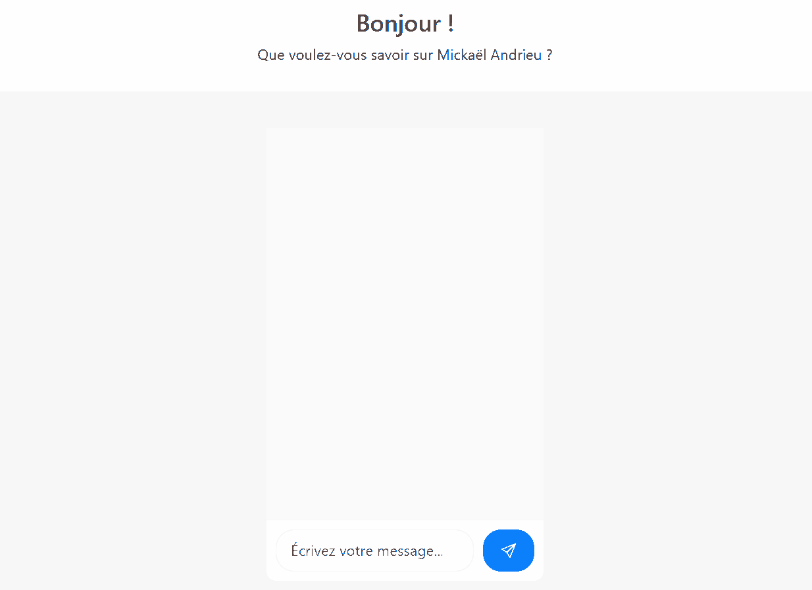

# 🎤 Me.AI, Votre clone numérique intelligent

Une application Java 23 / Spring Boot/AI pour assister l'utilisateur à mieux se présenter en entretien d'embauche (grâce à l'IA).

## C'est quoi, Me.AI ?



## ⚙️ Prérequis

- Docker
- Une clé API OpenAI (ex: `sk-...`)

## 🔧 Configuration

1 seule variable d’environnement est requise pour configurer la clé API OPEN AI :

```bash
PITCH_OPEN_AI_API_KEY=ta_cle_openai
PITCH_OPEN_AI_MODEL=gpt-4o
PITCH_OPEN_AI_TEMPERATURE=0.7
```

Ensuite ajoutez votre CV au format PDF dans le dossier `src/main/resources/static` avec le nom suivant : "**cv.pdf**"
Enfin, ajoutez votre photo au format jpeg `src/main/resources/static/` avec le nom suivant : "**me.jpeg**"

## ▶️ Lancer le Projet

```bash
docker-compose up --build
```

Puis visitez [http://localhost:8080](http://localhost:8080).

## 🧪 Lancer les tests

```bash
./mvnw test
```

## Et sinon ?

Fait avec ❤️ par Mickaël Andrieu, ouvert aux suggestions mais pas aux contributions. 

**Le code de ce projet est réutilisable et exploitable commercialement, sans aucune condition d'attribution.**
